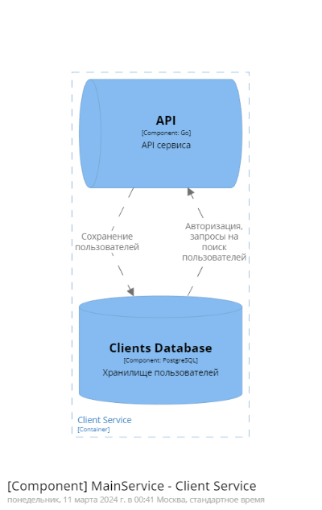

# Сервис поиска попутчиков

| Автор  | Группа  |
|:---|:---|
| Волков Матвей  | М8О-109М-23  |

Данный сервис отвечает за огранизацию поиска попутчиков.
У нас есть *водители*, которые могут организовывать маршрут и есть *пассажиры*, которые могут создать поездку.
Если маршрут водителя пересекается с пунктом назначения пассажира, то пассажир может доехать с водителем.

## Требования к сервису
**Приложение должно содержать следующие данные:**
- Пользователь
- Маршрут
- Поездка

**Реализовать API:**
- Создание нового пользователя
- Поиск пользователя по логину
- Поиск пользователя по маске имя и фамилии
- Создание маршрута
- Получение маршрутов пользователя
- Создание поездки
- Подключение пользователей к поездке
- Получение информации о поездке

## Описание архитектуры

### UserCases

Подключение пользователя к поездке происходит в асинхронном режиме. Приложению пользователя надо только самостоятельно получать статус его поездки, чтобы понять к кому он присоединен.

### Выкатка

